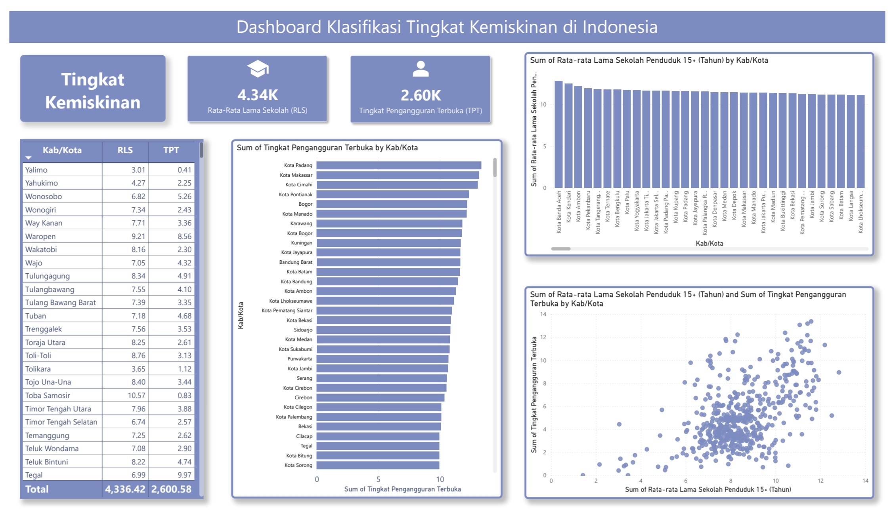

# Indonesia Poverty Classification Dashboard

## Project Overview

This project presents an interactive Power BI dashboard that analyzes socioeconomic indicators across Indonesian cities and regencies. The dashboard explores the relationship between education level (Average Years of Schooling) and unemployment rate to support poverty classification and regional comparison.

The dashboard enables users to identify regional patterns, compare socioeconomic indicators, and explore potential relationships between education and unemployment.

Google spreadsheet link: https://docs.google.com/spreadsheets/d/1SJSvj4fXf6uRSjqxvn2IxScHx89O-BLcCyrEUGyQVgY/edit?usp=sharing

---

## Tools

- Power BI
- Microsoft Excel
- Power Query

## Dashboard Preview

---

## Dashboard Features

### 📊 KPI Cards

Displays key socioeconomic indicators:

- Average Years of Schooling (RLS)
- Open Unemployment Rate (TPT)

---

### 📋 Regional Data Table

Provides detailed socioeconomic data for each city/regency, including:

- City/Regency
- Average Years of Schooling (RLS)
- Open Unemployment Rate (TPT)

---

### 📈 Unemployment Ranking

Ranks cities and regencies based on Open Unemployment Rate (TPT), allowing users to identify regions with relatively higher unemployment levels.

---

### 🎓 Education Comparison

Visualizes Average Years of Schooling (RLS) across Indonesian cities and regencies to compare educational attainment.

---

### 🔍 Correlation Analysis

A scatter plot visualizes the relationship between:

- Average Years of Schooling (RLS)
- Open Unemployment Rate (TPT)

This chart helps identify patterns and potential associations between education and unemployment across regions.

---

## Key Insights

- Compare socioeconomic indicators across Indonesian cities and regencies.
- Identify regions with relatively high unemployment rates.
- Observe variations in educational attainment among regions.
- Explore the relationship between education level and unemployment through correlation analysis.
- Support data-driven understanding of regional socioeconomic conditions.

---
